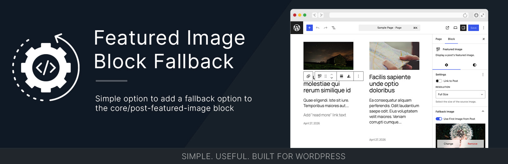

# Featured Image Block Fallback

[](https://wordpress.org/)
[](https://www.php.net/)
[](https://github.com/bob-moore/Featured-Image-Block-Fallback/releases/latest)
[](https://www.gnu.org/licenses/gpl-2.0.html)

[](https://github.com/bob-moore/Featured-Image-Block-Fallback/actions/workflows/lint-css.yml)
[](https://github.com/bob-moore/Featured-Image-Block-Fallback/actions/workflows/lint-js.yml)
[](https://github.com/bob-moore/Featured-Image-Block-Fallback/actions/workflows/lint-php.yml)

Add a fallback image to the `core/post-featured-image` block for posts that have no featured image set.

## What this does

The WordPress `core/post-featured-image` block is great—until a post doesn't have a featured image. By default, it simply renders nothing, leaving an awkward gap in your design.

Featured Image Block Fallback solves this by allowing you to specify a fallback image directly on the block. It displays whenever a post lacks a featured image—no global settings, no unnecessary bloat.

Whether you're building custom templates, using query loops, or designing unique layouts, this plugin ensures your site looks polished even when a featured image is missing.

## Features

- Adds a fallback image control to the `core/post-featured-image` block in the editor
- Optionally skips the fallback when the post already contains an inline image
- Filterable fallback ID (`featured_image_block_fallback_id`) for per-post-type customization
- Works as a standalone plugin or reusable Composer dependency

## Requirements

- WordPress 6.5+
- PHP 8.2+

## Installation

### Install as a plugin

1. Download the latest release zip from the [GitHub Releases page](https://github.com/bob-moore/Featured-Image-Block-Fallback/releases).
2. In WordPress admin, go to **Plugins > Add New Plugin > Upload Plugin**.
3. Upload the zip and activate **Featured Image Block Fallback**.

### Install via Composer (library usage)

If you are embedding this into your own project:

```bash
composer require bmd/featured-image-block-fallback
```

Then bootstrap:

```php
use Bmd\FeaturedImageBlockFallback\Plugin;

$dependency_url  = plugin_dir_url( __FILE__ ) . 'vendor/bmd/featured-image-block-fallback/';
$dependency_path = plugin_dir_path( __FILE__ ) . 'vendor/bmd/featured-image-block-fallback/';

$plugin = new Plugin(
    $dependency_url,
    $dependency_path
);

$plugin->mount();
```

The `Plugin` constructor expects the URL and filesystem path to the Featured Image Block Fallback dependency root, not the file where you call it. For example, pass `/path/to/vendor/bmd/featured-image-block-fallback/` and the matching public URL for that directory.

## Usage

1. Add a **Post Featured Image** block to a template or query loop.
2. Open the block sidebar and expand the **Fallback Image** panel.
3. Select a fallback image using the media picker.
4. Optionally enable **Use First Image from Post** to skip the fallback when the post already has an inline image.
5. Save the template.

## Updates

This plugin is distributed through GitHub releases (not WordPress.org). The plugin includes a scoped GitHub updater so WordPress can detect and apply new versions from this repository.

## Frequently Asked Questions

### Can I set a different fallback image for different post types?

Yes. Since the fallback image is set directly on the block, you can assign different fallback images to each query loop or post template that uses `core/post-featured-image`.

Developers can also customize the fallback dynamically using the `featured_image_block_fallback_id` filter:

```php
add_filter( 'featured_image_block_fallback_id', function( int $fallback_id, array $block ): int {
    if ( get_post_type( get_the_ID() ) === 'my-custom-post-type' ) {
        return 123; // Replace with your fallback image ID.
    }
    return $fallback_id;
}, 10, 2 );
```

### Can I override the asset path or URL?

Yes. Filter `featured_image_block_fallback_plugin_path` or `featured_image_block_fallback_plugin_url` to redirect asset resolution.

### Is this plugin available on the official WordPress plugin repository?

No. It is distributed via GitHub only.

## Changelog

### 0.3.2

- Unified plugin architecture around `ServiceLoader`, `Plugin`, and `Utilities` classes.
- Updated namespace from `Bmd\` to `Bmd\FeaturedImageBlockFallback\` for safer standalone and Composer usage.
- Moved asset path and URL filters into `setPath()` and `setUrl()` setters.
- Replaced `buildPath()`/`buildUrl()` helper methods with inline path construction.
- Simplified `getScriptAssets()` into `getAssetData( string $key )`.
- Replaced combined lint-build workflow with separate `lint-css`, `lint-js`, and `lint-php` workflows.
- Removed `FallbackPreview` editor component (stashed for future work).

### 0.3.1

- Added scoped `bmd/github-wp-updater` bootstrap so GitHub releases can be delivered through the WordPress update UI.
- Added `wpify/scoper` release packaging configuration and a dedicated scoped dependency manifest.
- Refreshed release packaging workflow and prepared production release artifacts for GitHub distribution.

### 0.3.0

- Added `BasicPlugin` interface; `FeaturedImageBlockFallback` now implements it.
- Constructor now accepts URL and path directly with sanitized defaults.
- Added `buildPath()` and `buildUrl()` with filterable asset resolution.
- Fixed plugin bootstrap to pass URL and path to the constructor instead of `mount()`.

### 0.1.8

- Updated typo in plugin metadata.
- Explicitly declared asset path for the updater in the main plugin file.

### 0.1.5

- Added external updater dependency.

### 0.1.4

- Finalized initial public stable release.

### 0.1.0 – 0.1.3

- Created GitHub updater integration.
- Version bumps for testing updater and releases.
- Initial upload.

## License

GPL-2.0-or-later. See [LICENSE](https://www.gnu.org/licenses/gpl-2.0.html).
